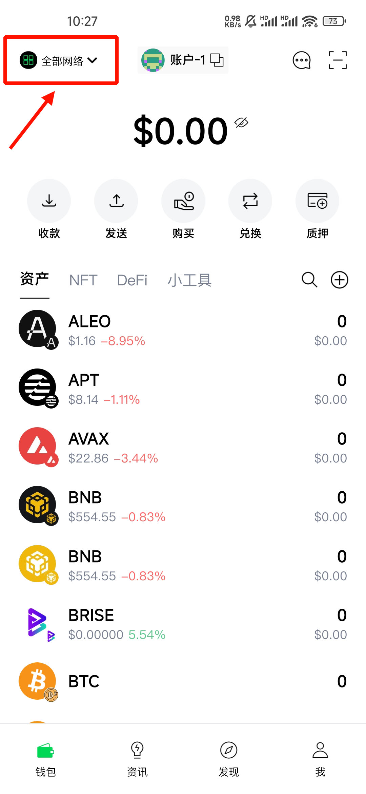
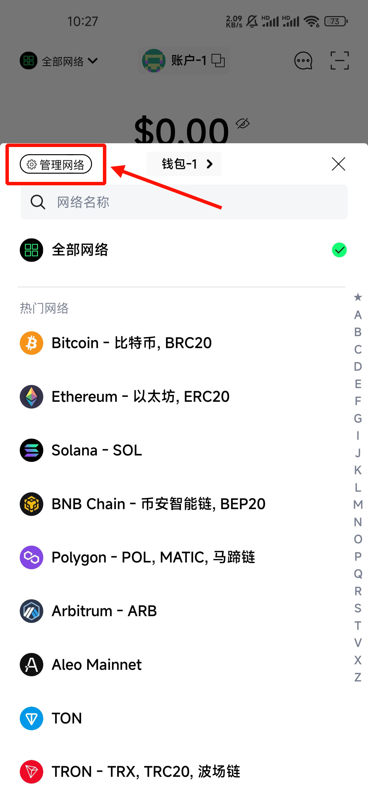
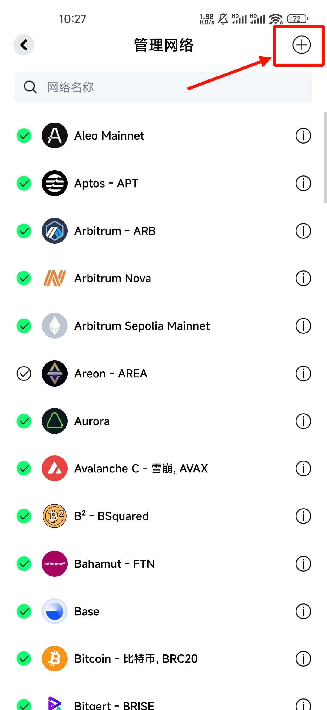
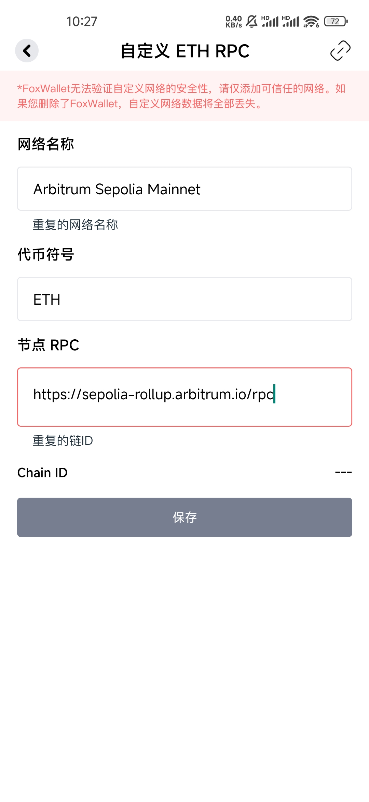
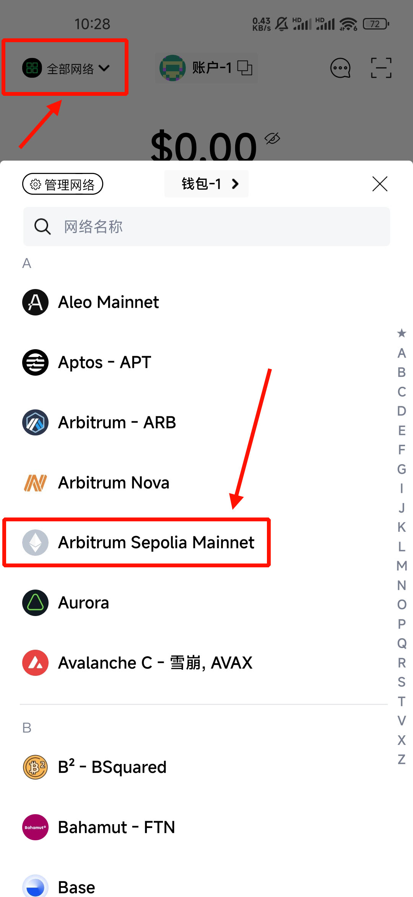
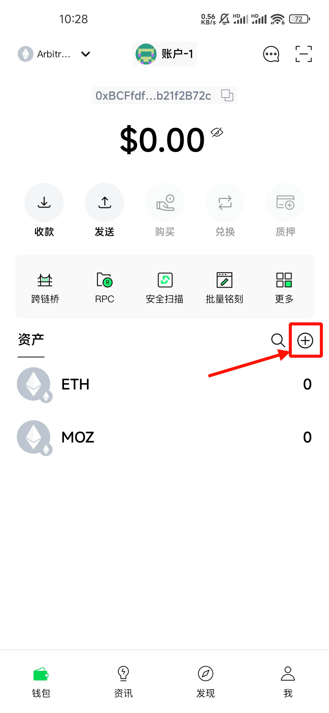
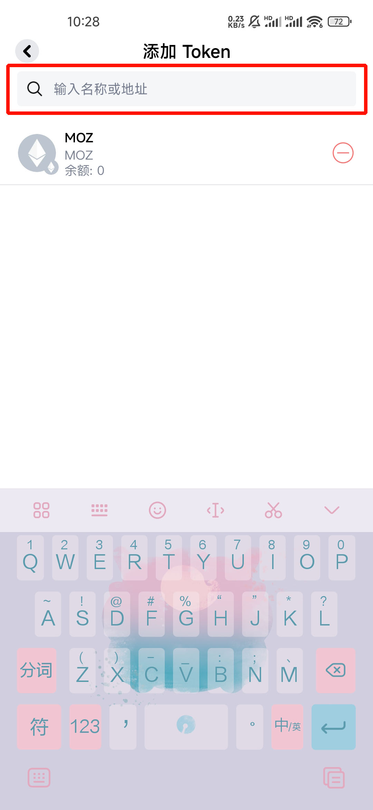

# zkwork Lumoz tutorial
首先是官方矿工程序与部署教程地址：[点击前往](https://github.com/6block/zkwork_moz_prover)

# 获取 MOZ 钱包地址
你可以使用以下钱包：
- [foxwallet](https://foxwallet.com/)
- [leowallet](https://www.leo.app/)
- [puzzle wallet](https://puzzle.online/)
<br/>

<h3>以下演示使用 foxwallet 钱包，获取 MOZ 钱包地址</h3>
<details>
  <summary>展开教程</summary>
  <h3>来到钱包主页，点击左上角的全部网络</h3>
  
  <h3>点击左上角的管理网络</h3>
  
  <h3>点击右上角的 ＋</h3>
  
  <h3>填入以下内容并保存</h3>

  ```
  网络名称: Arbitrum Sepolia Mainnet
  代币符号: ETH
  节点 RPC: https://sepolia-rollup.arbitrum.io/rpc
  ```
  如果你使用的是其他钱包，可以在discord消息获取其他参数([点击前往](https://discord.com/channels/984349855617011712/1301815847760957470/1302924757368573994))

  
  <h3>点击左上角的全部网络，在列表里找到刚才添加的 Arbitrum Sepolia Mainnet</h3>
  
  <h3>点击右侧的＋</h3>
  
  <h3>在顶部填写token</h3>

  ```
  Token: 0xFB81A910AAFE8f04242Bb364a8Cf7AC359e020bf
  ```
  如果不放心该Token，同样可以前往discord消息查看([点击前往](https://discord.com/channels/984349855617011712/1301815847760957470/1302924757368573994))

  
  <h3>至此你已经可以拿到MOZ钱包地址了，快去挖吧！</h3>
</details>

# 部署教程
还是官方矿工程序与部署教程地址：[点击前往](https://github.com/6block/zkwork_moz_prover)

以下是个人部署教程，前往官方地址获取最新的矿工程序 [点击前往](https://github.com/6block/zkwork_moz_prover/releases)

