# zkwork Lumoz tutorial
首先是官方矿工程序与部署教程地址：[点击前往](https://github.com/6block/zkwork_moz_prover)</br>
查询自己挖了多少币、当前算力等... [点击前往](https://zk.work/zhTW/lumoz)

# 获取 MOZ 钱包地址
你可以使用以下钱包：
- [FoxWallet](https://foxwallet.com/)
- [Metamask](https://metamask.io/)
- [TrustWallet](https://trustwallet.com/)
<br/>

<h3>以下演示使用 FoxWallet 钱包，获取 MOZ 钱包地址</h3>
<details>
  <summary>展开教程</summary>
  <h3>来到钱包主页，点击左上角的全部网络</h3>
  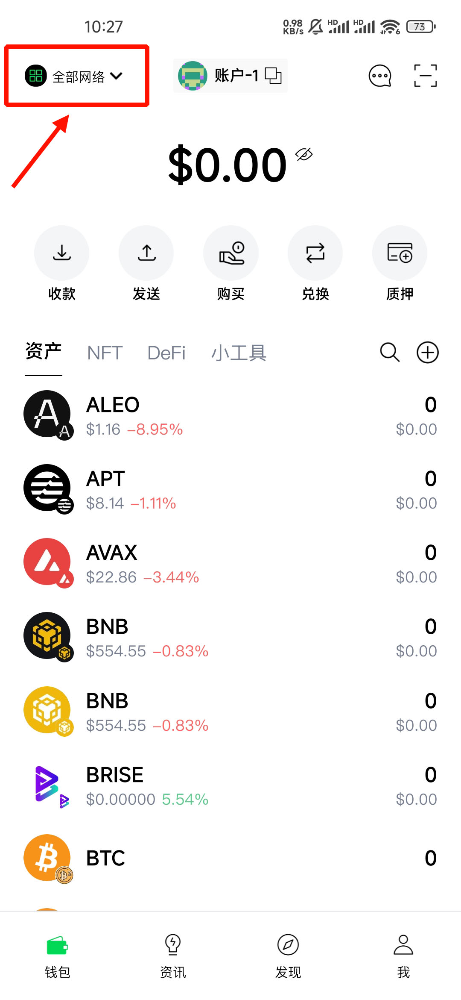
  <h3>点击左上角的管理网络</h3>
  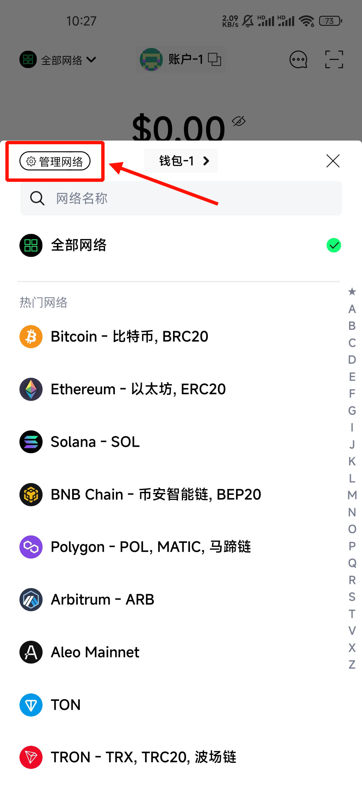
  <h3>点击右上角的 ＋</h3>
  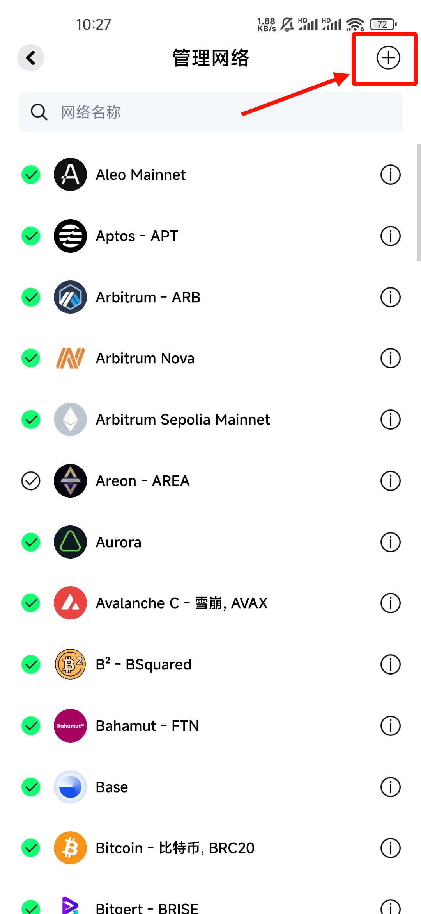
  <h3>填入以下内容并保存</h3>

  ```
  网络名称: Arbitrum Sepolia Mainnet
  代币符号: ETH
  节点 RPC: https://sepolia-rollup.arbitrum.io/rpc
  ```
  如果你使用的是其他钱包，可以在discord消息获取其他参数([点击前往](https://discord.com/channels/984349855617011712/1301815847760957470/1302924757368573994))

  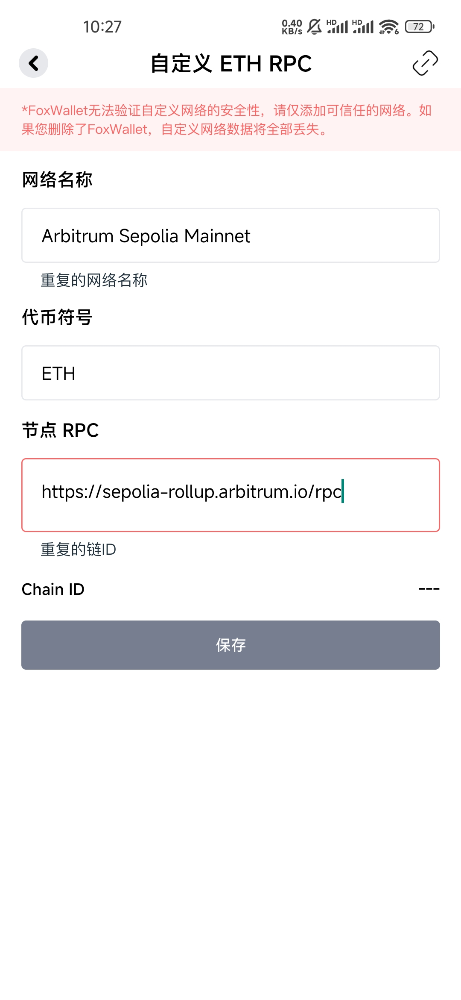
  <h3>点击左上角的全部网络，在列表里找到刚才添加的 Arbitrum Sepolia Mainnet</h3>
  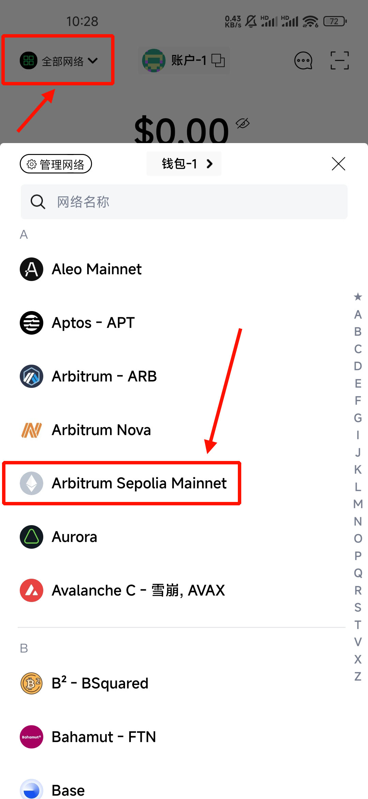
  <h3>点击右侧的＋</h3>
  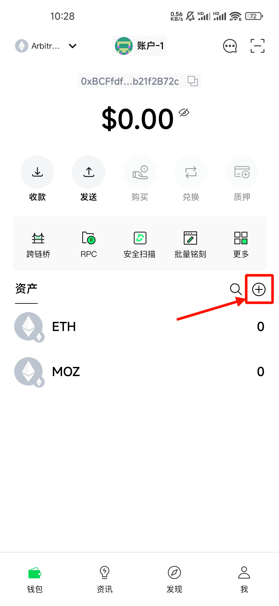
  <h3>在顶部填写token，并点击 MOZ 右侧绿色的＋，我这里已经添加过了</h3>

  ```
  0xFB81A910AAFE8f04242Bb364a8Cf7AC359e020bf
  ```
  如果不放心该Token，同样可以前往discord消息查看([点击前往](https://discord.com/channels/984349855617011712/1301815847760957470/1302924757368573994))

  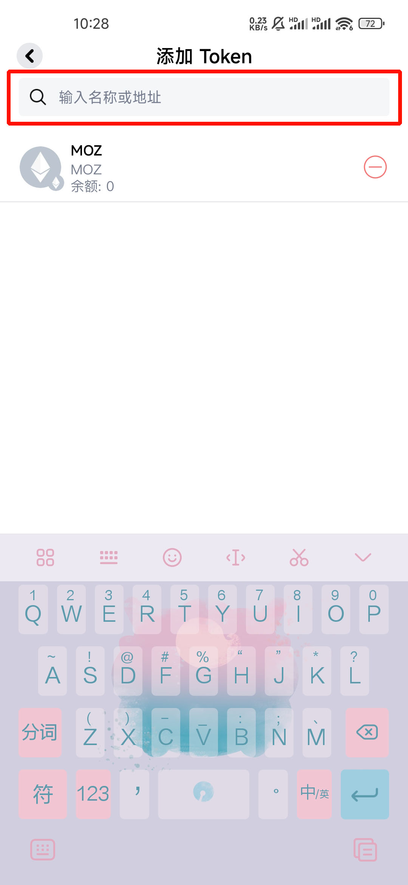
  <h3>至此你已经可以拿到MOZ钱包地址了，快去挖吧！</h3>
</details>

<h3>以下演示使用 Metamask 钱包，添加 MOZ</h3>

<details>
  <summary>展开教程</summary>
  <h3>打开浏览器插件，来到钱包页，点击左上角</h3>
  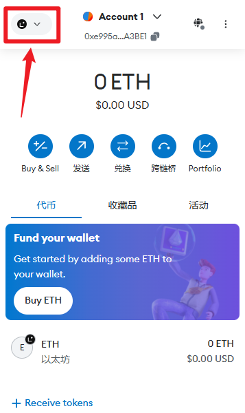
  <h3>点击添加网络</h3>
  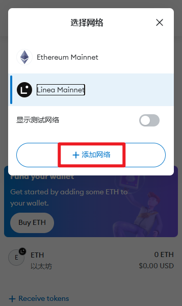
  <h3>点击手动添加网络</h3>
  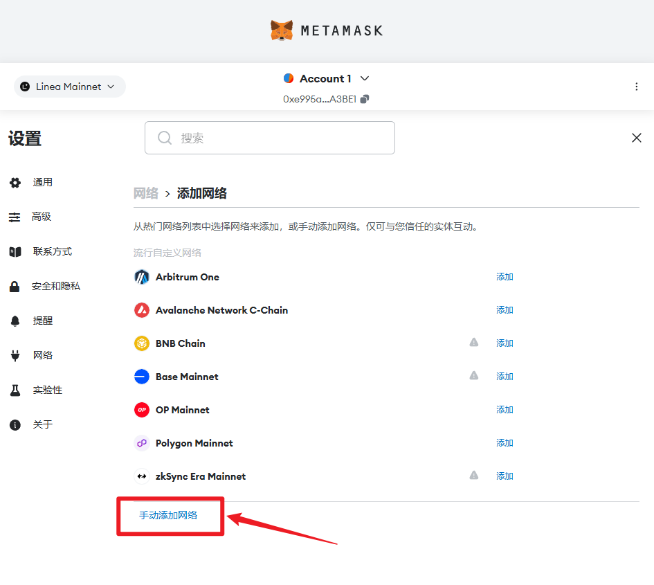
  <h3>填入以下内容并保存</h3>

  ```
  网络名称: Arbitrum Sepolia Mainnet
  新的 RPC URL: https://sepolia-rollup.arbitrum.io/rpc
  链 ID: 0x66eee
  货币符号: ETH
  ```
  如果你使用的是其他钱包，可以在discord消息获取其他参数([点击前往](https://discord.com/channels/984349855617011712/1301815847760957470/1302924757368573994))

  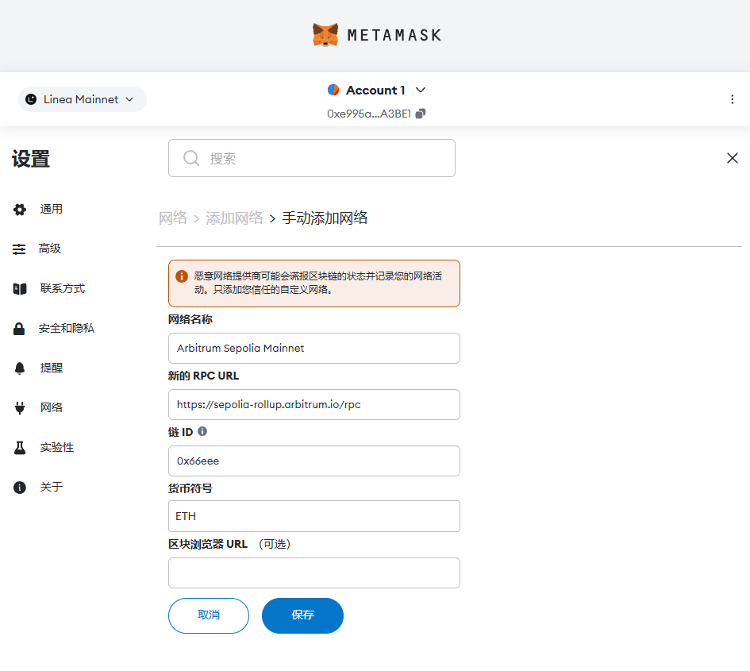
  <h3>保存后点击 切换至Arbitrum Sepolia Mainnet</h3>
  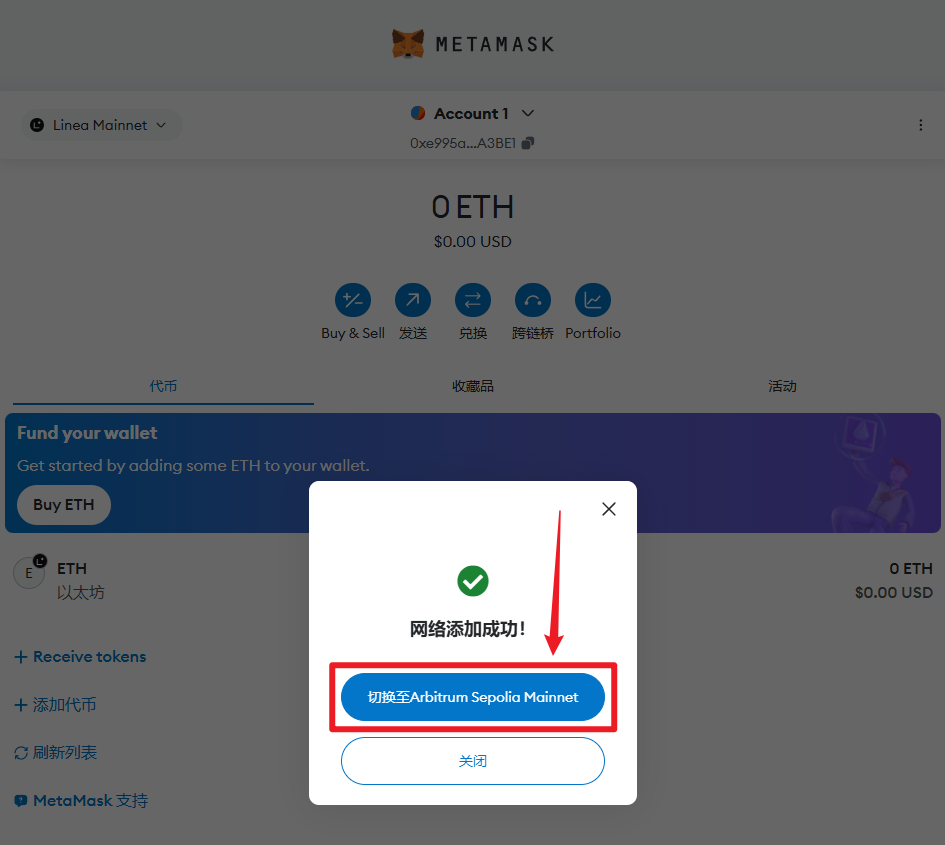
  <h3>点击添加代币</h3>
  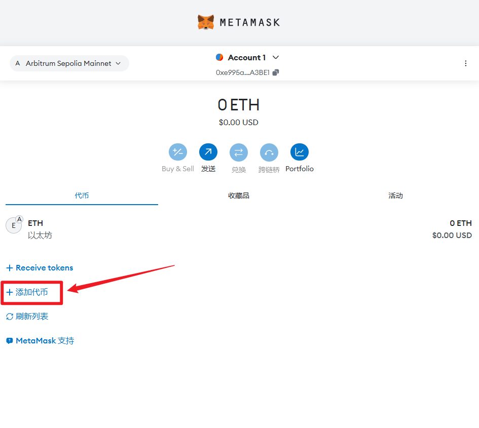
  <h3>在代币合约地址中填入以下内容，稍微等待地址识别，自动出现代币符号 MOZ后点击下一步</h3>

  ```
  0xFB81A910AAFE8f04242Bb364a8Cf7AC359e020bf
  ```
  如果不放心该Token，同样可以前往discord消息查看([点击前往](https://discord.com/channels/984349855617011712/1301815847760957470/1302924757368573994))

  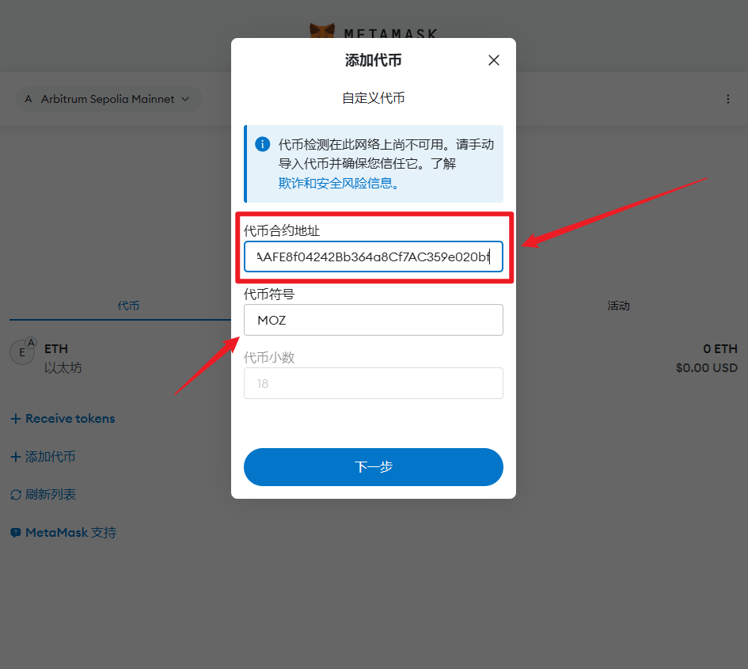
  <h3>点击导入</h3>
  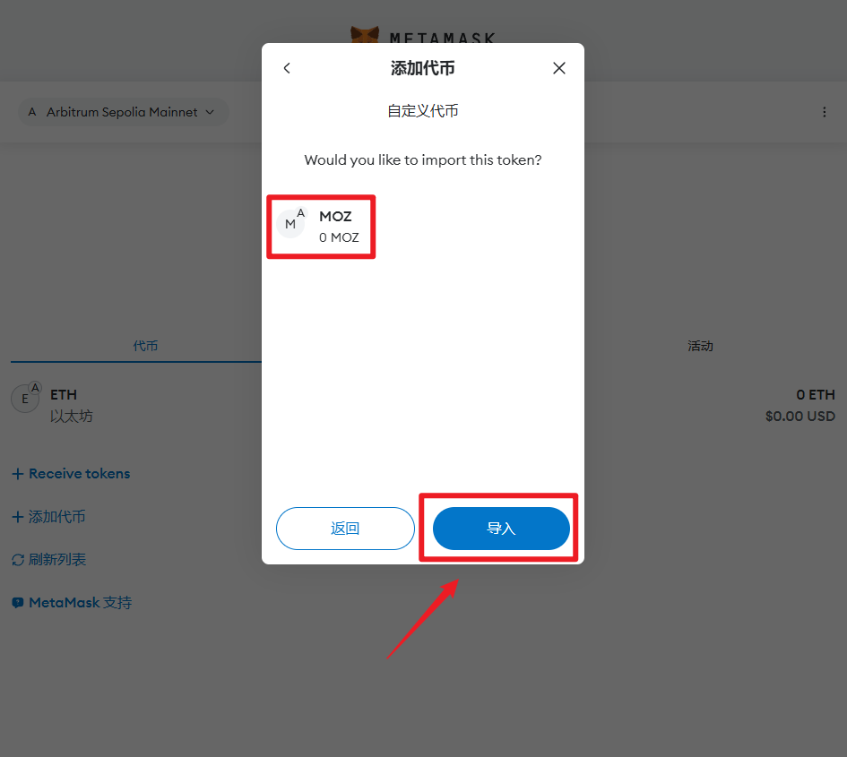
  <h3>至此你已经添加了MOZ 可以去挖矿了</h3>
  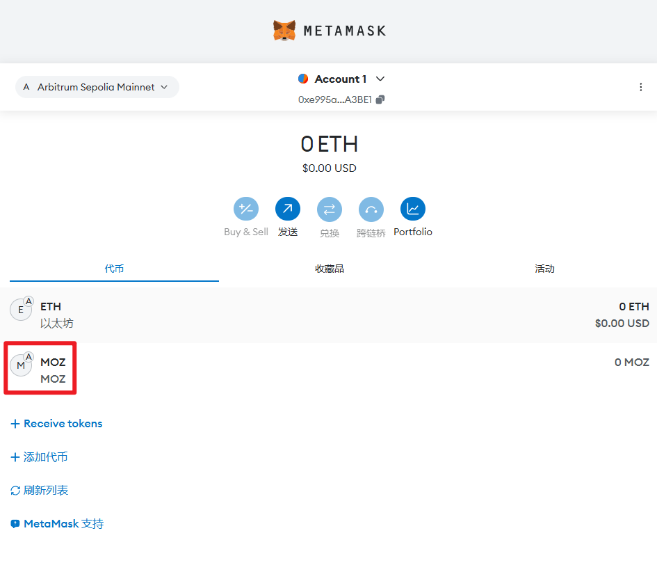
</details>

# 部署教程
还是官方矿工程序与部署教程地址，官方教程已经很清楚了：[点击前往](https://github.com/6block/zkwork_moz_prover)</br>
以下是个人部署教程，前往官方地址获取最新的矿工程序 [点击前往](https://github.com/6block/zkwork_moz_prover/releases)
<details>
  <summary>系统与驱动</summary>
  系统：Ubuntu 20.4 +</br>
  NVIDIA显卡驱动：535.54.03 + （AMD的显卡自己测）
</details>

<details>
  <summary>矿工程序选择</summary>

  NVIDIA显卡选择 `cuda`</br>
  AMD显卡选择 `ocl`
</details>

<details>
  <summary>下载文件、解压、配置</summary>
  下载矿工程序并解压

  ```
  wget https://github.com/6block/zkwork_moz_prover/releases/download/v1.0.1/moz_prover-v1.0.1_cuda.tar.gz
  tar -zvxf moz_prover-v1.0.1_cuda.tar.gz
  cd moz_prover
  ```

  打开文件 `inner_prover.sh` 并填写钱包地址和矿工名称
  ```
  reward_address=钱包地址
  custom_name="矿工名称"
  ```
  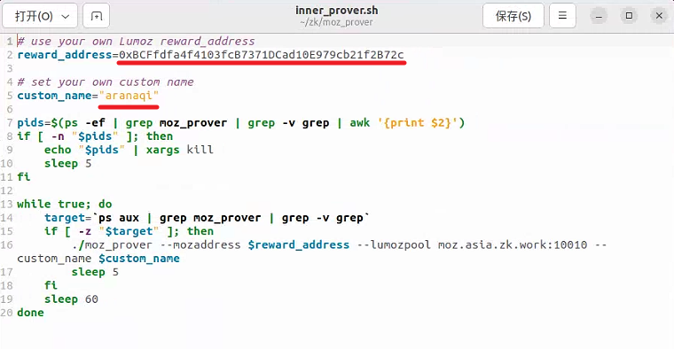
</details>

<details>
  <summary>运行矿工程序、查看日志</summary>

  运行矿工程序
  ```
  sudo chmod +x run_prover.sh
  ./run_prover.sh
  ```

  查看日志
  ```
  tail -f prover.log
  ```
  出现 `Lumoz: new proof generated for job xx` 就说明正常跑起来了</br>
  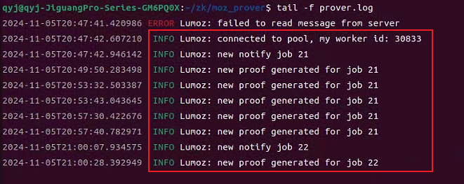
</details>

<details>
  <summary>不想手动部署? 来试试大佬的一键部署吧!</summary>

  [点击直达 一键部署](https://github.com/qq1739920004/zk_lumoz_auto.sh/tree/master)
</details>